# IT Help Desk Home Lab
 
A home lab built in VirtualBox simulating a real enterprise IT environment. This project covers Active Directory setup, Group Policy configuration, user management, shared folder permissions, and help desk ticketing using Jira Service Management.
 
---
 
## Tools Used
 
- Oracle VirtualBox
- Windows Server 2019
- Active Directory Domain Services (AD DS)
- DNS Server
- Group Policy Management (GPO)
- Active Directory Users and Computers (ADUC)
- File and Storage Services (NTFS Permissions)
- Jira Service Management
 
---
 
## 1. VirtualBox Setup
 
Deployed Windows Server 2019 as a virtual machine in Oracle VirtualBox with 4096 MB RAM and 50 GB storage.
 
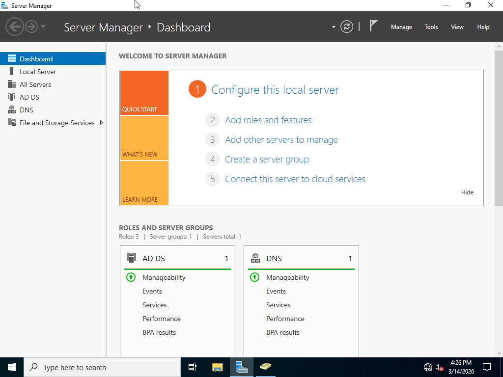
 
---
 
## 2. Windows Server Manager
 
Configured Windows Server with the following roles installed and running:
- Active Directory Domain Services (AD DS)
- DNS Server
- File and Storage Services
- Domain: `homelab.local`
 
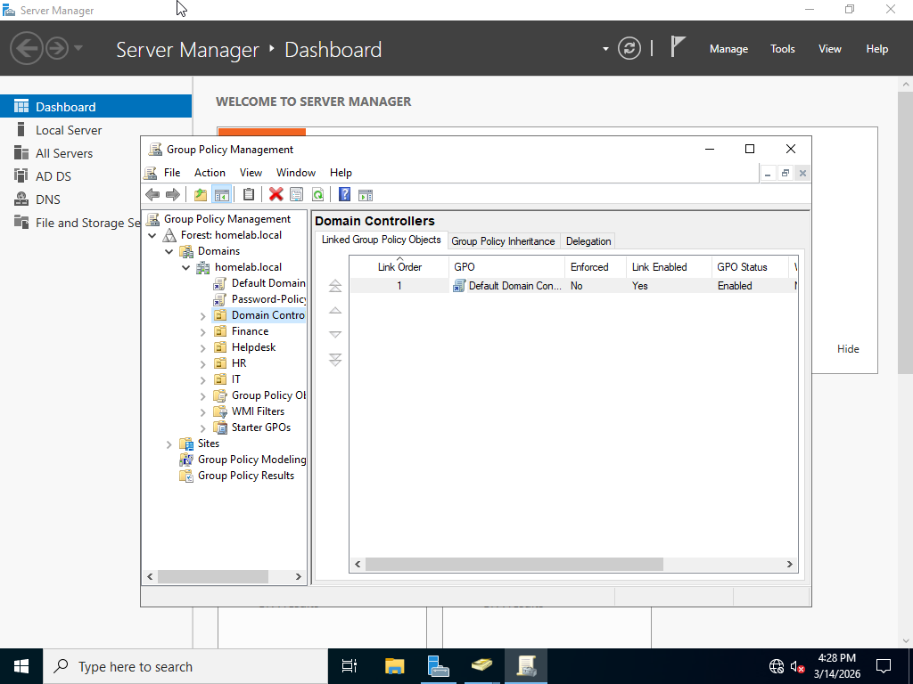
 
---
 
## 3. Active Directory — Organizational Units
 
Created the following Organizational Units (OUs) to simulate a real company structure:
 
| OU | Purpose |
|----|---------|
| Finance | Finance department users |
| HR | Human Resources users |
| IT | IT department users |
| Helpdesk | Help desk technician accounts |
 
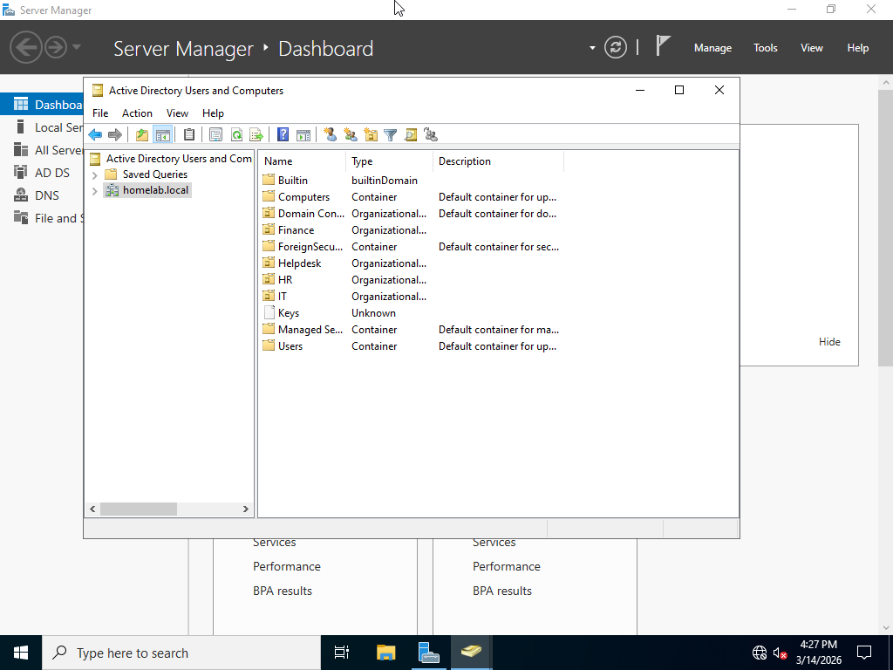
 
---
 
## 4. Group Policy Management
 
Opened Group Policy Management from Server Manager and viewed the full domain structure including all OUs.
 
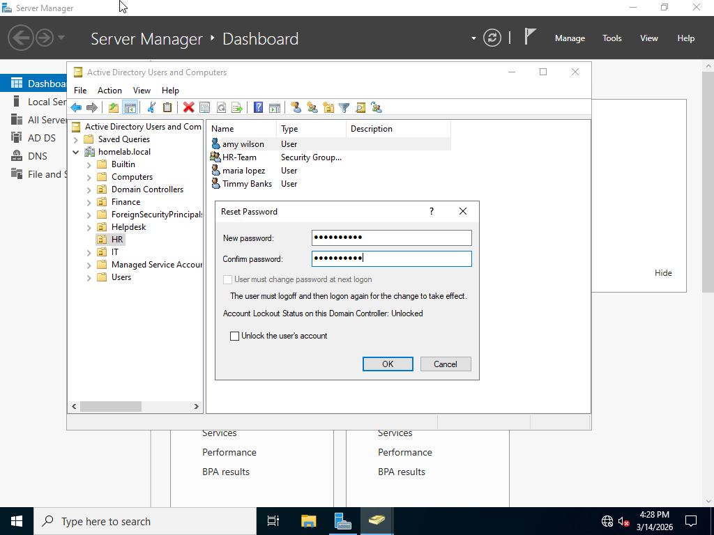
 
---
 
## 5. Password Reset in Active Directory
 
Simulated a help desk password reset by right-clicking a user in the HR OU and selecting Reset Password. Also demonstrated the account unlock option.
 
- Users created: amy wilson, maria lopez, Timmy Banks
- Security Group: HR-Team
 

 
---
 
## 6. Jira Service Management — Project Setup
 
Created an IT help desk project in Jira using the Basic IT Service Management template.
 
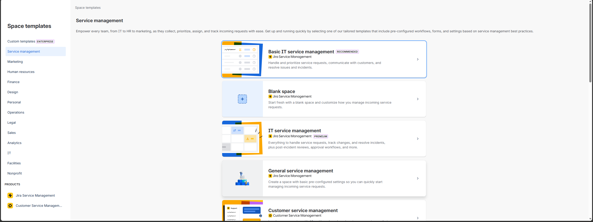
 
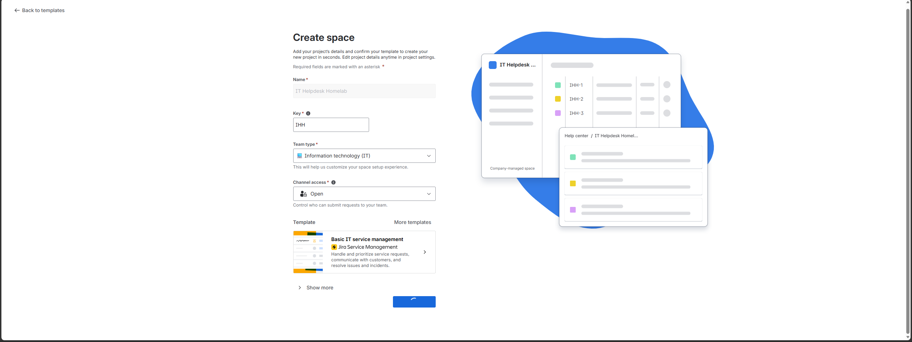
 
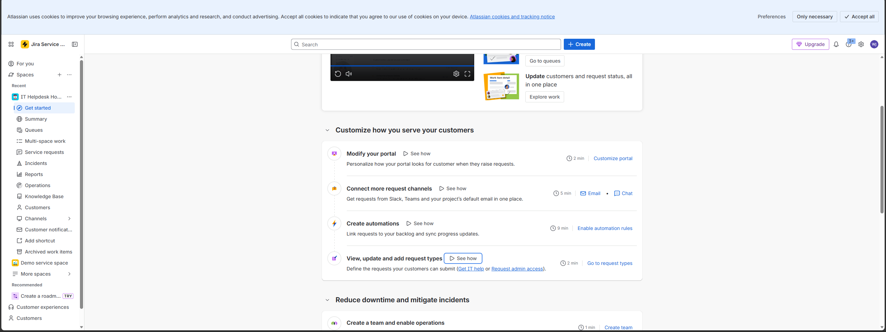
 
---
 
## 7. Jira — Open Service Requests Queue
 
Set up the ticketing queue to track and manage incoming IT support requests.
 
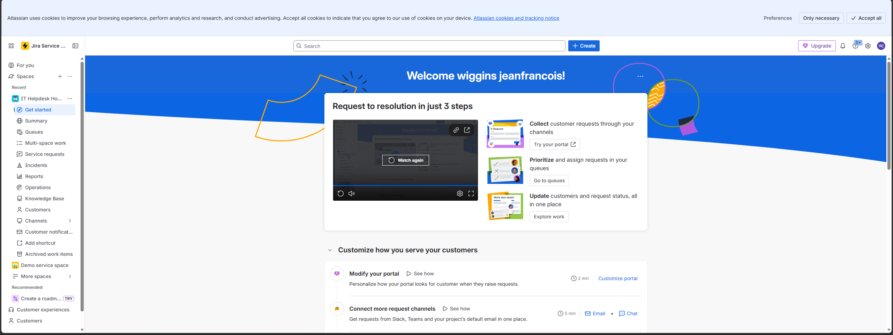
 
---
 
## 8. Jira — Creating a Ticket
 
Created service request tickets for common help desk scenarios.
 
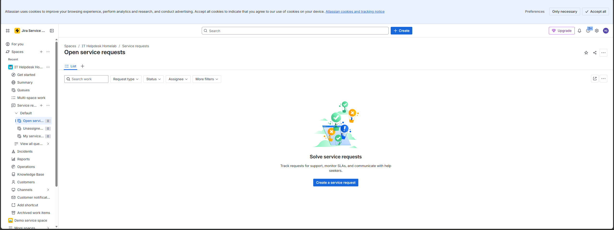
 
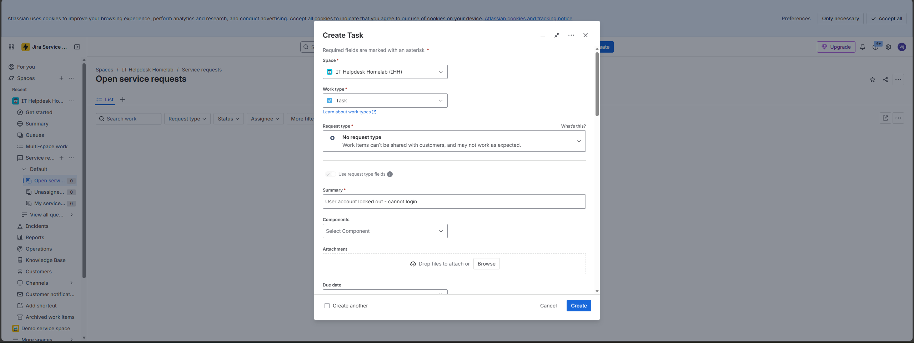
 
---
 
## 9. Jira — All 4 Tickets Created
 
Created and tracked 4 tickets simulating real help desk scenarios:
 
| Ticket | Issue | Priority |
|--------|-------|----------|
| IHH-1 | User account locked out — cannot login | High |
| IHH-2 | Password reset request | Medium |
| IHH-3 | New employee onboarding | Medium |
| IHH-4 | User cannot access shared folder | High |
 
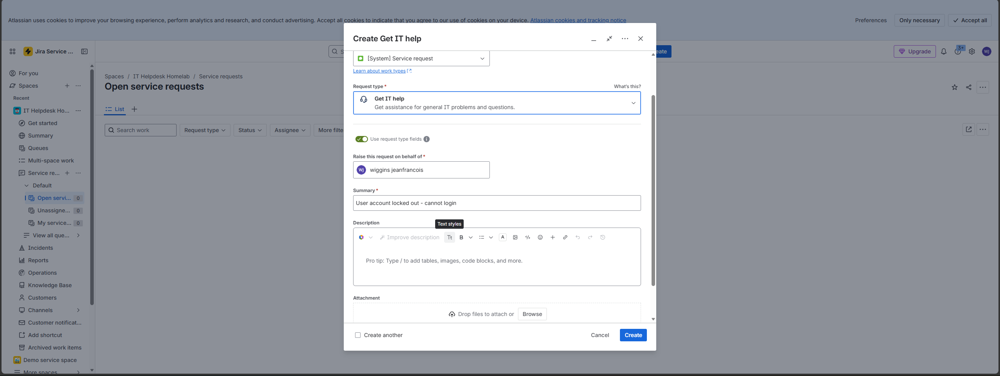
 
---
 
## 10. Jira — Ticket In Progress
 
Updated ticket IHH-1 status to In Progress and added resolution notes.
 
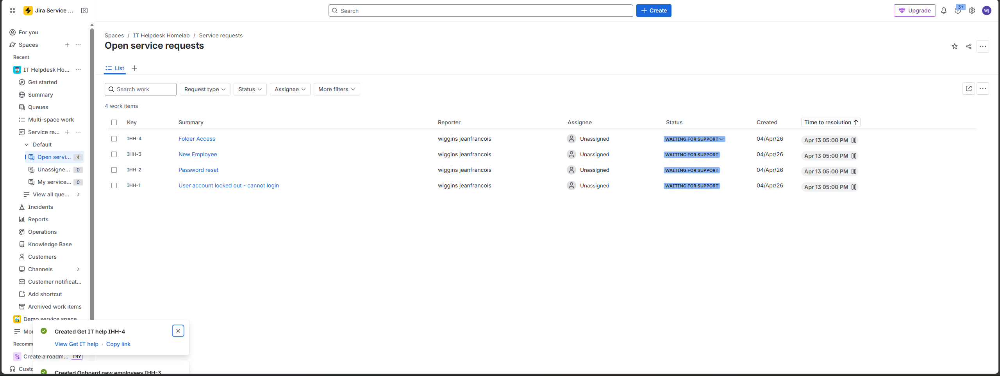
 
---
 
## 11. Jira — Resolving a Ticket
 
Resolved tickets with detailed resolution notes documenting the steps taken in Active Directory.
 
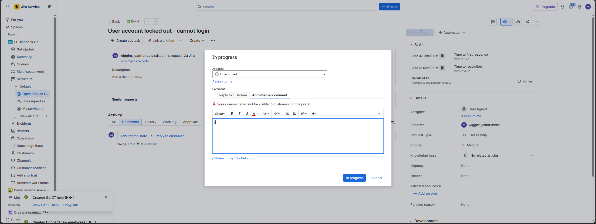
 
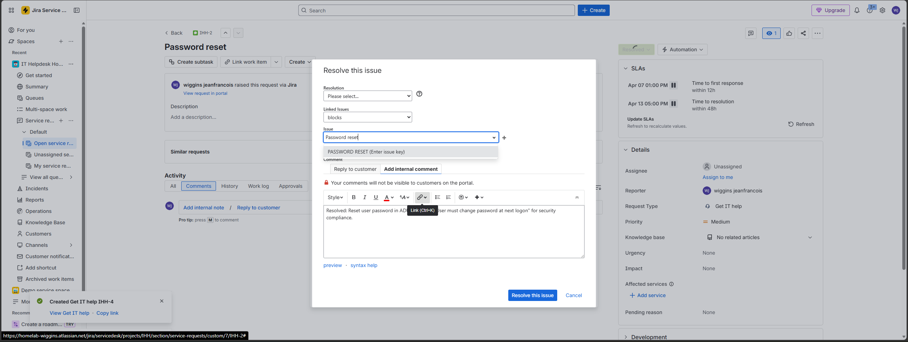
 
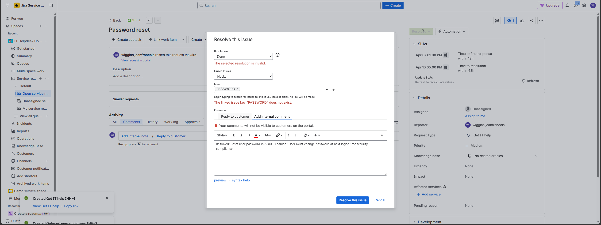
 
---
 
## Skills Demonstrated
 
- Deploying Windows Server in a virtualized environment using VirtualBox
- Configuring Active Directory with OUs, users, and security groups
- Managing Group Policy Objects (GPOs) across the domain
- Performing password resets and account unlocks in ADUC
- Configuring NTFS shared folder permissions by department
- Creating and resolving IT support tickets in Jira Service Management
- Simulating the full help desk ticket lifecycle from open to resolved
 
---
 
